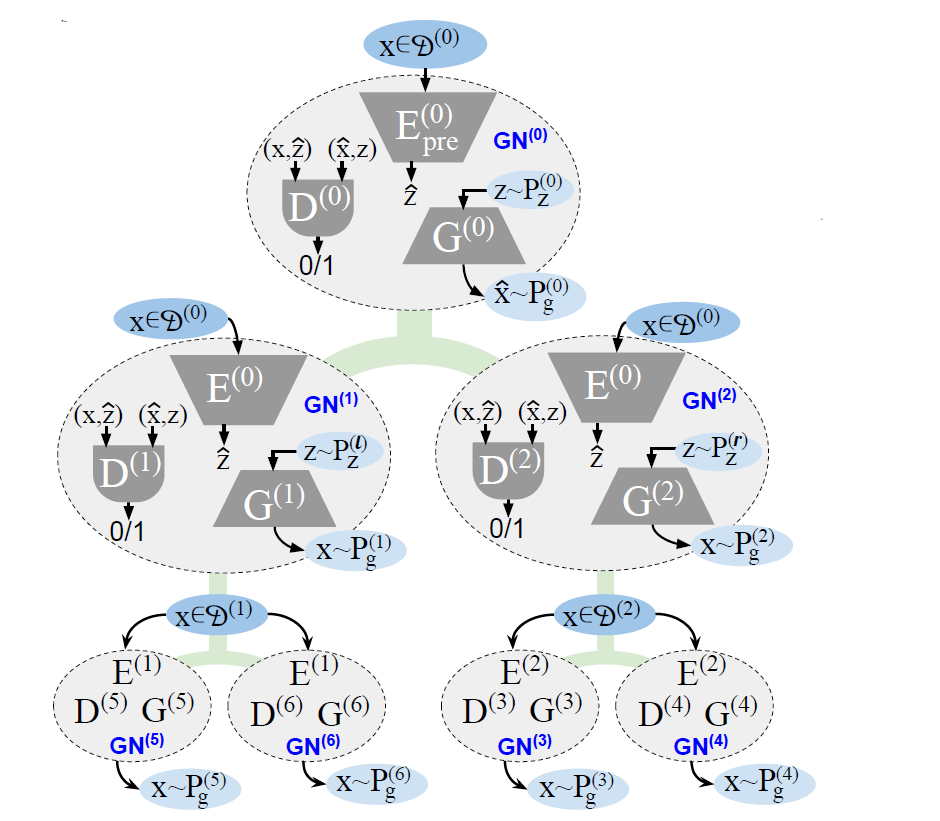
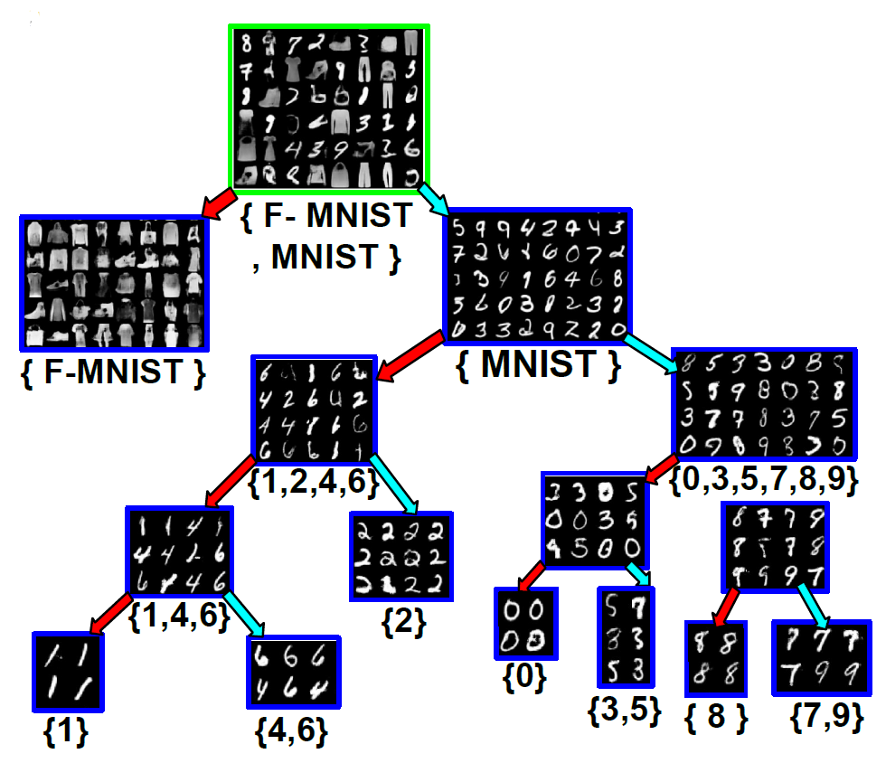
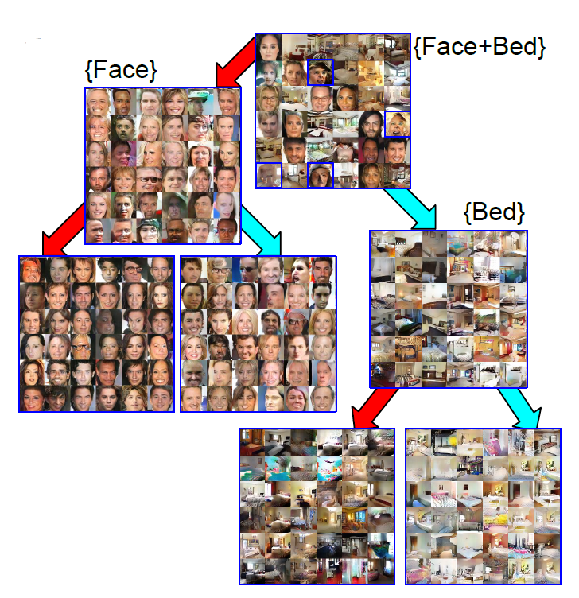
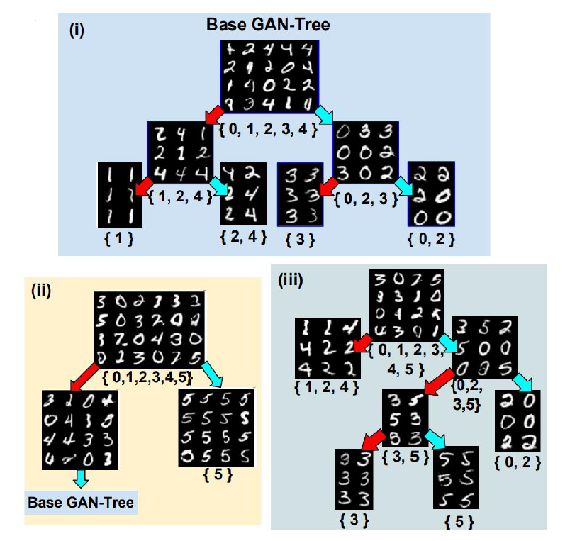

# GAN-Tree: An Incrementally Learned Hierarchical Generative Framework for Multi-Modal Data Distributions
This repository contains code for the paper `GAN-Tree: An Incrementally Learned Hierarchical Generative Framework for Multi-Modal Data Distributions`, published in ICCV 2019.

The full paper can be found [here](https://arxiv.org/abs/1908.03919).  If you find our research work helpful, please consider citing:

```cite
@article{kundu2019gan,
  title={GAN-Tree: An Incrementally Learned Hierarchical Generative Framework for Multi-Modal Data Distributions},
  author={Kundu, Jogendra Nath and Gor, Maharshi and Agrawal, Dakshit and Babu, R Venkatesh},
  journal={arXiv preprint arXiv:1908.03919},
  year={2019}
}
```

## Contents
1. [Overview of the Model](#1-overview-of-the-model)
2. [Setup Instructions and Dependencies](#2-setup-instructions-and-dependencies)
3. [Training GAN Tree from Scratch](#3-training-gan-tree-from-scratch)
    1. [Parser Arguments](#31-parser-arguments) 
4. [Repository Overview](#4-repository-overview)
5. [Experiments](#5-experiments)
    1. [GAN Tree for Single Channel Dataset](#51-gan-tree-for-single-channel-dataset)
    2. [GAN Tree for Single Channel Mixed Dataset](#52-gan-tree-for-single-channel-mixed-dataset)
    3. [GAN Tree for Multiple Channel Mixed Dataset](#53-gan-tree-for-multiple-channel-mixed-dataset)
    4. [Incremental GAN Tree](#54-incremental-gan-tree)
6. [Results Obtained](#6-results-obtained)
    1. [Generated GAN Tree for Single Channel Mixed Dataset](#61-generated-gan-tree-for-single-channel-mixed-dataset)
    2. [Generated GAN Tree for Multiple Channel Mixed Dataset](#62-generated-gan-tree-for-multiple-channel-mixed-dataset)
    3. [Generated iGANTree for Adding Digit 5](#63-generated-iGANTree-for-adding-digit-5)
7. [Guidelines for Contributors](#7-guidelines-for-contributors)
    1. [Reporting Bugs and Opening Issues](#71-reporting-bugs-and-opening-issues)
    2. [Pull Requests](#72-pull-requests)
8. [License](#8-license)


## 1. Overview of the Model

<p align="center">
    
</p>

The overall GAN Tree architecture is given in the above figure.  For further details about the architecture and training algorithm, please go through the paper.

## 2. Setup Instructions and Dependencies
You may setup the repository on your local machine by either downloading it or running the following line on `cmd prompt`:

``` Batchfile
git clone https://github.com/val-iisc/GANTree.git
```

All dependencies required by this repo can be downloaded by creating a virtual or conda environment with Python 2.7 and running

``` Batchfile
pip install -r requirements.txt
```

The `LSUN Bedroom Scene` and `CelebA` datasets required for training can be found in the Google Drive link given inside the `data/datasets.txt` file.

> 1. Make sure to have the proper CUDA version installed for PyTorch v0.4.1.
> 2. The code will not run on Windows since Pytorch v0.4.1 with Python 2.7 is not supported on it.

## 3. Training GAN Tree from Scratch
To train your own GAN Tree from scratch, run

```Batchfile
python GANTree.py -hp path/to/hyperparams -en exp_name 
```

+ The hyperparameters for the experiment should be set in the `hyperparams.py` file (check `src/hyperparams` for examples).
+ The training script will create a folder `experiments/exp_name` as specified in the `hyperparams.py` file or argument passed in the command line to the `-en` flag.
+ This folder will contain all data related to the experiment such as generated images, logs, plots, and weights. It will also contain a dump of the hyperparameters.

>1. Training will require a large amount of RAM.
>2. Saving GNodes requires ample amount of space (~500 MB per node).

### 3.1. Parser Arguments

The following argument flags are available for training:

+ `-hp`, `--hyperparams`: path to the `hyperparam.py` file to be used for training.
+ `-en`, `--exp_name`: experiment name.
+ `-g`, `--gpu`:  index of the gpu to be used. The default value is `0`.
+ `-t`, `--tensorboard`:  if `true`, start Tensorboard with the experiment.  The default value is `false`.
+ `-r`, `--resume`: if `true`, the training resumes from the latest step.  The default value is `false`.
+ `-d`, `--delete`: delete the entities from the experiment file. The default value is `[]`. The choices are `['logs', 'weights', 'results', 'all']`.
+ `-w`, `--weights`: the weight type to load if resume flag is provided.  The default value is `iter`.  The choices are `['iter', 'best_gen', 'best_pred']`.

## 4. Repository Overview
This repository contains the following folders:

1. **data**: Contains the various datasets.

2. **experiments**: Contains data for different runs.

3. **resources**: Contains resources for the README.

4. **src**: Contains all the source code.

    i. **base**: Contains the code for all base classes.
    
    ii. **dataloaders**: Contains various dataloaders.
    
    iii. **hyperparams**: Contains different `hyperparam.py` files for running various experiments.
    
    iv. **models**: Contains code for constructing AAE models, GNode and GAN-Tree.
    
    v. **modules** and **utils**: Contains code for various functions used frequently.
    
    vi. **trainers**: Contains code for the trainers of a particular GNode.

## 5. Experiments

### 5.1. GAN Tree for Single Channel Dataset

We train GAN Tree on the MNIST dataset, which is a single channel dataset consisting of handwritten datasets.  To run the experiment, the following command can be executed:

```python
python GANTree_MNIST.py
```

### 5.2. GAN Tree for Single Channel Mixed Dataset

We train GAN Tree on the MNIST and Fashion MNIST dataset mixed together to test its performance on datasets with a clear discontinuous manifold.  To run the experiment, the following command can be executed:

```python
python GANTree_MNIST_Fashion_Mixed.py
```

### 5.3. GAN Tree for Multiple Channel Mixed Dataset

We train GAN Tree on the LSUN Bedroom Scene and CelebA dataset mixed together to test its robustness in the multiple channel scenario.  To run the experiment, the following command can be executed:

```python
python GANTree_FaceBed.py
```

### 5.4. Incremental GAN Tree

GAN Tree has the unique feature of being able to learn new related data without the need of previous data, i.e. learn incrementally.  To run the experiment mentioned in the paper, the following command can be executed:

```python
python GANTree_MNIST_0to4.py
```

After creating a GAN Tree trained on the digits 0-4 from the MNIST dataset, we add the digit 5. To incrementally learn a GAN Tree for the same, run the following command:

```python
python iGANTree_add5_dsigma4.py
````

or

```python
python iGANTree_add5_dsigma9.py
```

## 6. Results Obtained
### 6.1. Generated GAN Tree for Single Channel Mixed Dataset

<p align="center">
    
</p>

### 6.2. Generated GAN Tree for Multiple Channel Mixed Dataset

<p align="center">
    
</p>

### 6.3. Generated iGANTree for Adding Digit 5

<p align="center">
    
</p>

## 7. Guidelines for Contributors

### 7.1. Reporting Bugs and Opening Issues

If you'd like to report a bug or open an issue then please:

**Check if there is an existing issue.** If there is, then please add any more information that you have, or give it a 👍.

When submitting an issue please describe the issue as clearly as possible, including how to reproduce the bug. If you can include a screenshot of the issues, that would be helpful.

### 7.2. Pull Requests

Please first discuss the change you wish to make via an issue.

We don't have a set format for Pull Requests, but expect you to list changes, bugs generated and other relevant things in the PR message.

## 8. License

This repository is licensed under MIT license.
